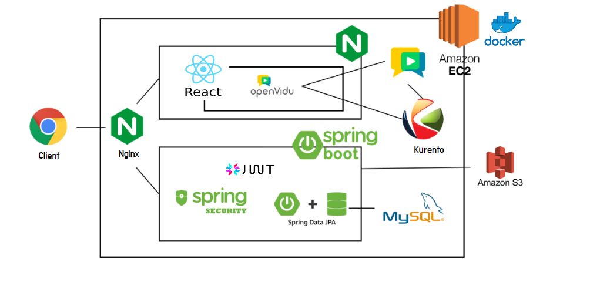
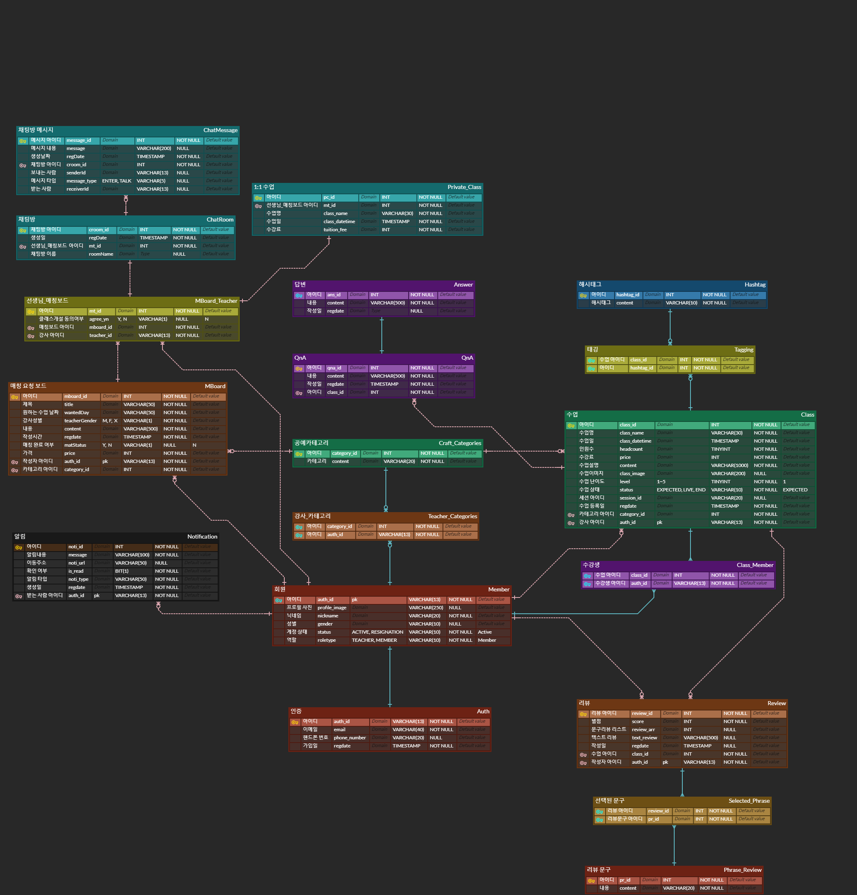

# 🧶CLIV


온라인 실시간 수업을 기반으로 한 공예생활 플랫폼

> 🔗배포 링크 : https://i7a605.p.ssafy.io

<br/>

## 📆 프로젝트 개요

- **진행 기간** : 2021.07.11 ~ 2022.08.19
- 온라인으로 실시간 공예 수업을 듣고 싶은 사람들을 위한 커뮤니티 & 화상수업 플랫폼 서비스
- **주요기능**
  - 실시간 공예 수업
  - 수업 내 도움요청 기능
  - 맞춤 클래스 추천
  - 1:1 수업 매칭

## 👨팀원 소개

| 이름   | 역할 | 담당        |
| ------ | ---- | ----------- |
| 김민주 | 팀원 | `Back-end`  |
| 박지원 | 팀원 | `Front-end` |
| 조혜진 | 팀원 | `Front-end` |
| 최윤정 | 팀원 | `Front-end` |
| 허성은 | 팀장 | `Back-end`  |

## 🐻개발 환경 및 구성

### Back-end

- Spring Boot : Spring Boot 2.4.5 (Gradle)
- DB : MYSQL 8.0.30
- JAVA : openJDK (1.8.0_332)
- Docker : 20.10.17
- Nginx 1.18.0

### Front-end

- React 18.2.0
- Node.js: 18.7.0
- OpenVidu : 2.20.0

<br/>

# Wiki

<a href="https://lab.ssafy.com/s07-webmobile1-sub2/S07P12A605/-/wikis/WebRTC%EB%9E%80%3F">WebRTC란?</a>

<a href="https://lab.ssafy.com/s07-webmobile1-sub2/S07P12A605/-/wikis/%EC%B9%B4%EC%B9%B4%EC%98%A4-%EB%A1%9C%EA%B7%B8%EC%9D%B8---Spring-Security---JWT-%ED%86%A0%ED%81%B0-%EA%B5%AC%ED%98%84-%ED%9D%90%EB%A6%84%EB%8F%84">카카오 로그인 + Spring Security + JWT 토큰 구현 흐름도</a>

<a href="https://lab.ssafy.com/s07-webmobile1-sub2/S07P12A605/-/wikis/%ED%94%84%EB%A1%9C%EC%A0%9D%ED%8A%B8-%EB%B0%B0%ED%8F%AC">프로젝트 배포</a>


# 시스템 아키텍쳐 구조


# ERD


# Code Convention

## 💬 BE 기본 규칙

🐪 **CamelCase** 사용하기

🐈‍⬛ **CleanCode** 작성하기 - 메서드명은 기능을 나타낼 수 있는 이름으로! 클래스명과 변수명은 어떤 역할을 하는지 알아보기 쉽게!

## 🧐 주석

### ✅ 클래스 설명

클래스 상단에 다음 형식으로 주석 달아주기

```java
/**  
* @FileName : ${file_name}  
* @작성자 : ${user}  
* @Class 설명 : 
*/
```

### ✅ 메서드 설명

메서드 **내부** 최상단에 다음 형식으로 주석 달아주기 

```java
/**  
* @Method Name : ${enclosing_method}  
* @작성자 : ${user}  
* @Method 설명 : 
*/
```

### ✅ 기타 주석 설명

이해하기 힘들다고 생각되는 로직에는 `//` 붙여서 설명 달아주기

## 🙌 명명규칙

### 🧊 Entity

- **클래스명** : ERD 상의 Table 명과 동일한 카멜표기법으로 작성하기. 만약 예약어와 겹칠 경우에는 ‘Table명 + 임의의 단어` 형식으로 생성
- **변수명** : ERD 상의 Column 명과 동일한 카멜표기법으로 작성
- **어노테이션 설정**
    - `@Setter` 지양하기
    - `@Builder` 설정하기

### 🧊 DTO = Request, Response

- **명명규칙**
    - Entity명 + Request/Response
    - ex) AuthResponse, AuthRequest
- DTO와 Entity가 서로 변환되기 위해 **Querydsl 구현 필요**

### 🧊 Repository - Querydsl, JpaRepository

- **JpaRepository**
    - 명명규칙 : Entity명 + repository
        - ex) AuthRepository
    - 구현 규칙
        - `@Repository` 어노테이션 등록
        - JpaRepository 상속받기
        - JpaRepository에는 Key : Entity, Value: Entity PK 데이터타입 설정해주기
    
    ```java
    @Repository
    public interface AuthRepository extends JpaRepository<Auth, String> {
    
    }
    ```
    

- QuerydslRepository
    - 명명규칙 : Entity 명 + `QuerydslRepository`
        - ex) MemberQuerydslRepository
    - 구현 규칙
        - `@Repository` 어노테이션 등록
        - `@RequiredArgsConstructor` 어노테이션 등록
        - JpaQueryFactory 의존성 주입 받기
